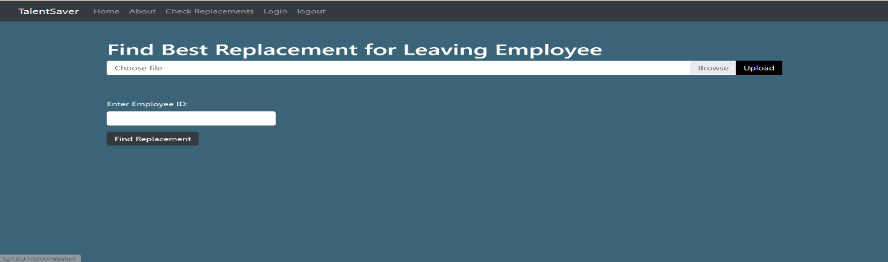
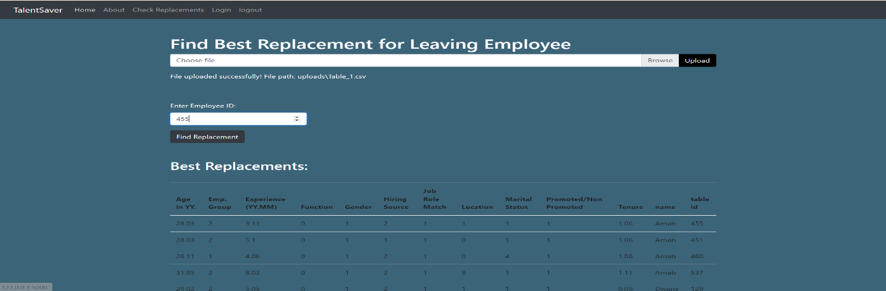
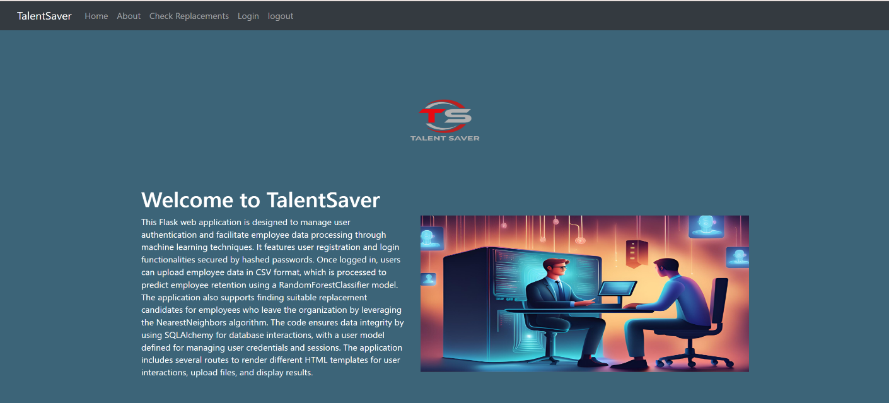

# TalentSaver: Employee Attrition Prediction & Replacement System

**TalentSaver** is a cutting-edge, machine learning-based solution designed to address employee attrition and replacement challenges within organizations. This project predicts employee attrition and suggests suitable replacements within the organization to ensure a seamless transition and minimize productivity disruptions.

## Key Features:
- **Machine Learning Integration:** TalentSaver uses advanced machine learning models, such as Random Forest and Support Vector Machines, to predict employee attrition based on historical data.
- **Real-Time Predictions:** The system provides real-time predictions of employee attrition, allowing organizations to proactively manage their workforce.
- **Employee Replacement Suggestions:** Based on the attrition predictions, the system suggests the best possible replacement candidates from within the organization.
- **Data Processing and Preprocessing:** Automated data collection, cleaning, and feature selection ensure that only high-quality data is used for predictions.
- **Cross-Browser and Mobile Compatibility:** The web-based application is optimized for both mobile devices and popular browsers.
- **User Authentication and Security:** Secure login and user authentication mechanisms protect sensitive HR data.
- **Interactive UI:** The web application provides an intuitive interface for users to input data, visualize predictions, and analyze workforce trends.

## User Interface Screenshots:

### 1. **Home Page**

*Description:* The home page provides an overview of the TalentSaver application, highlighting its purpose and key features.

### 2. **Signup Page**

*Description:* The Signup Page allows new users to create an account by providing a username, email address, and password.

### 3. **Login Page**

*Description:* The Login Page allows existing users to log in to their accounts by entering their email address and password.

### 4. **Check Replacements Page**

*Description:* The Check Replacements Page allows users to upload employee data in CSV format and find the best replacement for a leaving employee.

### 5. **Result Display for Replacement**

*Description:* After uploading the file and entering the Employee ID, the system displays the best replacement candidates.

### 6. **Another UI View**

*Description:* Another view showcasing the user interface of the TalentSaver application with an interactive, modern design.

## Objectives:
- To develop a user-friendly web application framework that allows HR professionals to predict employee attrition and find suitable replacements.
- To integrate machine learning algorithms capable of providing accurate attrition predictions and facilitating real-time data processing.
- To ensure cross-platform compatibility and a seamless user experience across devices.

## Key Benefits:
- **Increased Efficiency:** By predicting attrition trends, organizations can reduce hiring costs and improve workforce stability.
- **Proactive Employee Retention:** Helps HR departments identify employees at risk of leaving and implement strategies to retain top talent.
- **Data-Driven Decisions:** Provides HR teams with insights into the causes of attrition, facilitating informed decision-making.

## Technologies Used:
- **Frontend:** HTML, CSS, JavaScript, and Python Flask for server-side operations.
- **Machine Learning Algorithms:** Random Forest, Support Vector Machine (SVM), and other ensemble techniques for predicting attrition.
- **Database:** MySQL for storing employee data and predictions.

## Future Work:
- Integration of more advanced models (e.g., deep learning techniques) for improved accuracy.
- Enhanced feedback mechanisms to further refine the prediction models based on real-world user input.

---

### Contributors
- **Shoaib Ahmed (Group Leader & Project Leader)**
- **Abdul Basit Memon**
- **Muhammad Muzammil Naveed**
- **Muhammad Imtiaz Ali**

### Supervisor:
- **Sir Maaz Ahmed**

### Coordinator:
- **Dr. Rizwan Munir**
